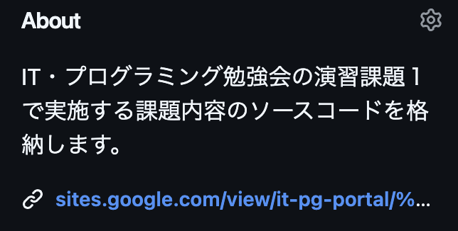

# IT・プログラミング勉強会 演習課題１（Ph1）リポジトリ

このリポジトリは、「IT・プログラミング勉強会」で利用する演習課題１（Ph1）Pythonコードを管理する公開リポジトリです。

演習課題１の実施内容は、「IT・プログラミング勉強会」の公式ポータルサイトを確認してください。※関係者及び勉強会参加者のみ確認可

## 演習課題１(Ph1)の実施内容

お題：簡単なバトルゲームを作ってみよう！

内容：

1. プレイする人の名前を自由に設定できるようにしよう
2. プレイヤーのHPもしくは敵のHPが0かマイナスになるまでバトルを繰り返そう
3. プレイヤーのHPもしくは敵のHPが0かマイナスになったらゲームを終了しよう
4. プレイヤーと敵の攻撃時にランダムでクリティカルヒットポイントを追加して攻撃できるようにしよう

使うプログラミングの技術

- 逐次実行（上から順番にプログラムを実行する）
- 条件判定・分岐（ある条件を判断し、逐次実行AかBどちらを実行するかを判断する）
- 繰り返し（ある条件を満たすまで同じ処理を繰り返す）
- 乱数（ランダムにある範囲（1～100の間など）の数字を自動で出す）

4つのプログラミングの技術を使用します。

それぞれの技術は、Python学習テキストで解説していますので参考にしてください！

ポータルサイトは以下操作方法（リンク）でご確認いただけます。



## サンプルコードの確認方法と実行方法について

https://github.com/martin-of-freedom-develop/IT.PG-Ph1/blob/main/Phase1/Phase1.py

上記リンク先のPythonコードを以下コマンドで実行すると、サンプルゲームを起動することができます。

→今後のお題の内容及び機能の拡張性を考慮しPython仮想環境（venv）を利用しています。

**実行方法**

Phase1.pyの格納されているフォルダまで移動し、以下コマンドを実行してください。

```txt
Python3 Phase1.py
```

## リポジトリライセンス

このリポジトリは「Apache-2.0 license」となります。

詳しくは、「README」タブの横にある「Apache-2.0 license」タブをご確認ください。
